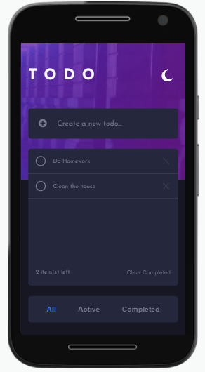
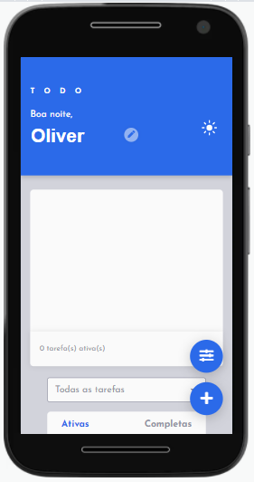

<h1 text-align="center">TODO</h1>

Um aplicativo para listagem de tarefas.

---

Este projeto foi baseado no desafio do <a href="https://www.frontendmentor.io/challenges/todo-app-Su1_KokOW">TODO App</a> da plataforma FrontEnd Mentor, e então personalizado por mim.

 <a href="#desafio">O desafio</a> | 
 <a href="#tecnologias">Tecnologias</a> | 
 <a href="#imagens">Imagens</a> | 
 <a href="#links">Links</a> | 
 <a href="#autor">Autor</a>

---

### Visão Geral

#### O desafio

O usuário pode:

- Usufruir do layout do aplicativo independente do tamanho da tela (Design Responsivo);
- Escolher entre modo escuro e claro;
- Ver os estados ativos e com foco dos elementos;
- Criar, completar e remover tarefas;
- Categorizar tarefas;
- Visualizar a lista de tarefas por "todas", "ativas" e "completas";
- Segurar e arrastar para reordenar a lista (apenas para computador);
- Ter as tarefas salvas no próprio navegador (localStorage);
- Escolher um nome de usuário;
- Como também pode escolher apagar todos os dados do localStorage.

---

#### Tecnologias

- HTML5 semântico
- Propriedades CSS customizadas
- Flexbox
- SASS Compiler
- Mobile-first Workflow
- JavaScript

---

#### Imagens

<h4>Identidade visual original</h4>

Da plataforma FrontEnd Mentor

<h4>Customização</h4>

---
#### Links

<a href="https://oliverids.github.io/todo-App/" target="_blank">Live Site URL</a>

(Este link do Github Pages mostrará apenas a nova versão customizada, da branch "novaui").

 
##### Frontend Mentor - [@oliverids](https://www.frontendmentor.io/profile/oliverids)

